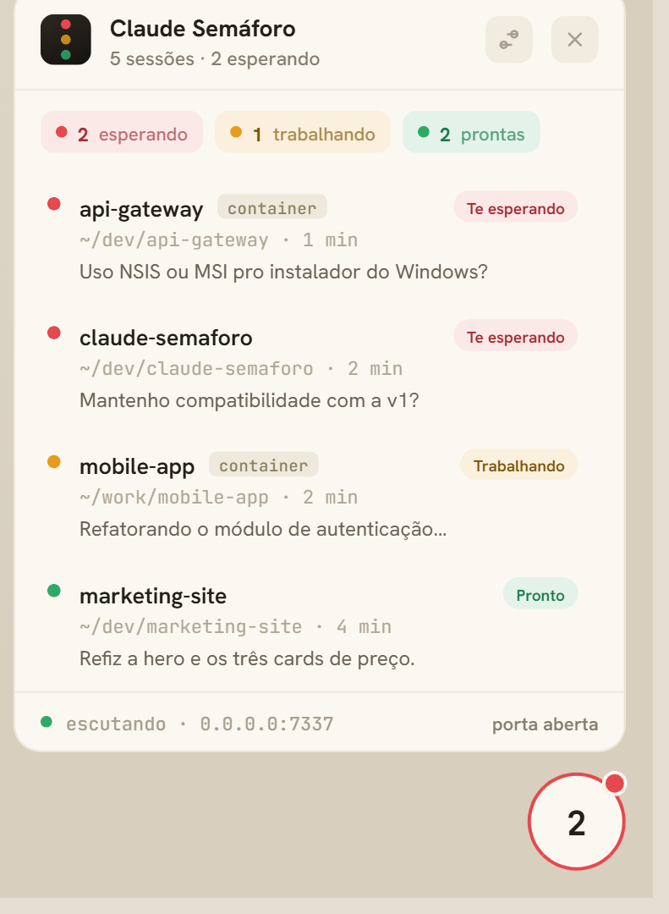
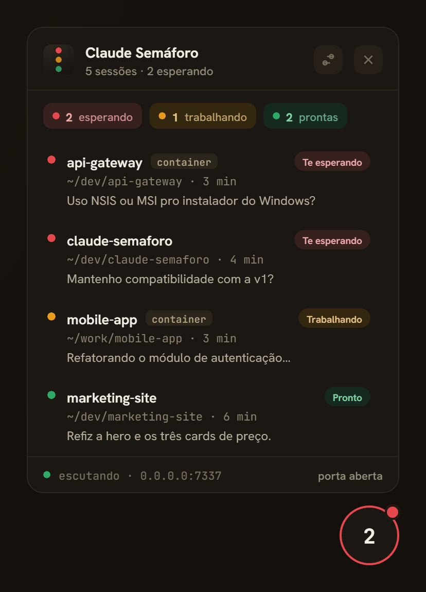
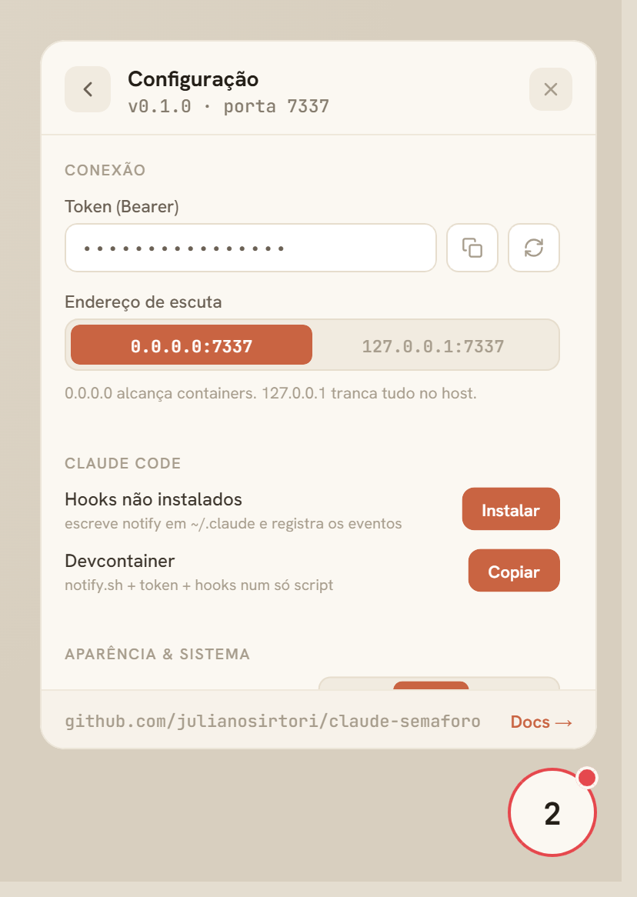

# Claude Semáforo

An always-on-top widget (Tauri + React) that aggregates the state of **all your
Claude Code sessions at once** — including ones running inside devcontainers —
and shows the worst state at a glance. Click to open the list per project. It is
**status-only**: it shows where each session stands, it never answers prompts on
your behalf.

<p align="center">
  
  
</p>

Three states per session:

- 🟡 **Trabalhando** — Claude is thinking (between your prompt and the end of the turn)
- 🔴 **Te esperando** — it stopped to ask / request something → act now
- 🟢 **Pronto** — the turn finished, there's output to review

The pill shows the **worst** state across every session (🔴 > 🟡 > 🟢) and a
counter (how many sessions are in that worst state).

## How it works

```
Claude Code session ──hook──▶ POST :7337/events  ──▶  widget updates state
```

The Rust backend runs a tiny HTTP listener on `0.0.0.0:7337`. Lifecycle hooks
(`UserPromptSubmit`→working, `Notification`→waiting, `Stop`→ready, `SessionEnd`→remove,
plus `PostToolUse` to un-stick a session left waiting) report state to `/events`,
fire and forget. The widget never gates tool calls, so a session in `auto` mode
is never prompted on its behalf. Listening on `0.0.0.0` is deliberate, so
containers can reach the host.

Every request must carry `Authorization: Bearer <token>`.

## Install

Grab the installer for your OS from the [Releases](https://github.com/julianosirtori/claude-semaforo/releases):

- **Windows** — `.exe` (NSIS). First run may ask to allow the port through the firewall.
- **Linux** — `.deb` or `.AppImage`.

Step-by-step walkthrough (PT-BR), with troubleshooting: [INSTALL.md](./INSTALL.md).

### Build from source

Requires Node 20+ and the Rust toolchain (plus the usual Tauri system deps).

```bash
npm install
npm run tauri dev      # run the widget
npm run tauri build    # produce installers in src-tauri/target/release/bundle
```

## Wiring the hooks

**Easiest (host, native):** open the pill → gear → **Claude Code → Instalar**.
That writes `notify.sh`/`notify.ps1` and the token to `~/.claude/`, and merges
the five state hooks into `~/.claude/settings.json` (keeping any hooks you already
have). Regenerating the token keeps working without reinstalling. The manual
steps below are for containers and remote workspaces.

1. Copy the hook script next to your Claude config:

   ```bash
   cp hooks/notify.sh ~/.claude/           # Linux / macOS / containers
   # Windows native:  copy hooks\notify.ps1 %USERPROFILE%\.claude\
   ```

2. Export the token the widget shows in **Configuração → Token** (copy button):

   ```bash
   export SEMAFORO_TOKEN="csf_...."
   ```

3. Register the hooks. Copy `.claude/settings.local.example.json` to
   `.claude/settings.local.json` (per project) or `~/.claude/settings.json`
   (global). It wires the five state events. On Windows native, swap the command
   for `powershell -NoProfile -File "%USERPROFILE%\.claude\notify.ps1"`.

### Reaching the host from a container

- **Docker Desktop** — `host.docker.internal` already resolves.
- **Docker on Linux** — add to your `devcontainer.json`:

  ```json
  "runArgs": ["--add-host=host.docker.internal:host-gateway"]
  ```

- **Remote workspace (Codespaces / SSH)** — point `SEMAFORO_URL` at a tunnel
  back to the widget, e.g. `export SEMAFORO_URL="http://127.0.0.1:7337"`.

The hook tries `host.docker.internal` first, then `127.0.0.1`, and tags
containerized sessions so the widget shows the `container` badge.

## Configuration

<p align="center">
  
</p>

Open the pill → gear:

- **Conexão** — copy/regenerate the Bearer token; switch the listen address
  between `0.0.0.0:7337` (reachable from containers) and `127.0.0.1:7337`
  (host only — locks out external access).
- **Aparência & sistema** — theme (Auto/Claro/Escuro), always-on-top, start with
  the system, OS notifications when a session turns 🔴, and a sound cue on state
  changes.

Environment overrides: `SEMAFORO_TOKEN`, `SEMAFORO_BIND` (e.g. `127.0.0.1:7337`).

## Quitting

The widget has no taskbar entry, so quit it from the **system tray** (right-click
the tray icon → **Sair**) or from the pill → gear → **Sair do Claude Semáforo**.
Left-clicking the tray icon toggles the panel.

## Development

```bash
npm run dev      # frontend only, with a live mock (open http://localhost:1420)
                 # add ?static to the URL to freeze the seed state for inspection
npm run build    # typecheck + production bundle
npm test         # frontend unit tests (vitest)
cargo test --manifest-path src-tauri/Cargo.toml   # backend unit tests
```

In a plain browser the UI runs against an in-memory mock that mirrors the design
prototype, so you can develop the interface without the desktop shell.

See [ARCHITECTURE.md](./ARCHITECTURE.md) for the full design.
